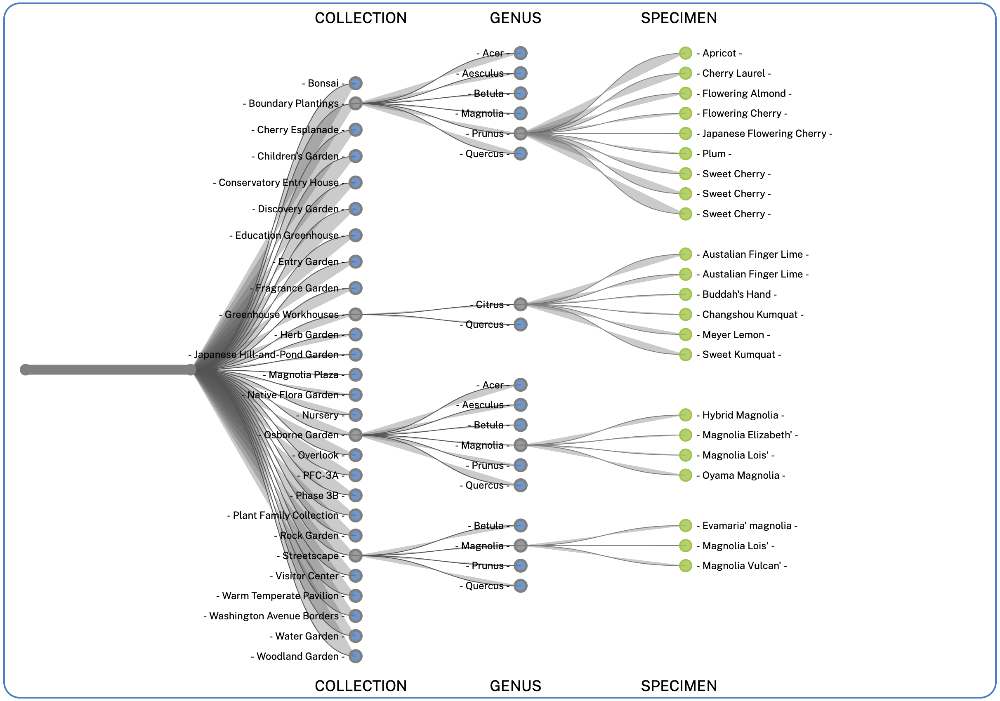

# [Brooklyn Botanic Garden Explorer Tree](https://edherm.github.io/BBG-explorer-tree/)

## Background and Overview
Brooklyn Botanic Garden (BBG) is a living museum dedicated to bringing an appreciation of the world of plants to the heart of their urban community. They are currently fighting development plans that would cast a shadow over the gardens and irreperably harm their collection.

This visualizes the BBG's Living Collection database in the shape of a tree:
* The root node represents BBG
* Branches represent individual collections
* Sub-branches represent a Genus found in a collection
* Leaves represent an individual specimen

## Functionality and MVPs
The BBG Tree Explorer gives users a unique view and way of exploring a selection of plant genera that can be found at Brooklyn Botanic Garden.

Users are able to collapse branches and explore the different collections of the garden by genera.

## Architecture and Technology
* HTML/CSS
* Javascript
* D3

## Implementation
* A CSV of the BBG collection database was converted into a hierarchical data structure using a combination of D3 and custom algorithms.
* The collapse animation is achieved with JS DOM manipulation by:
    * Adding event listeners to node-circles
    * Changing the start and end coordinates for the link-lines connecting nodes
    * Changing the opacity of different elements as they transition

## Future Features
* Add a dropdown to allow the user to select the plant family that they wish to view
* Add more genera from the database
* Toggle brown color on leaf nodes that will be affected by proposed development.