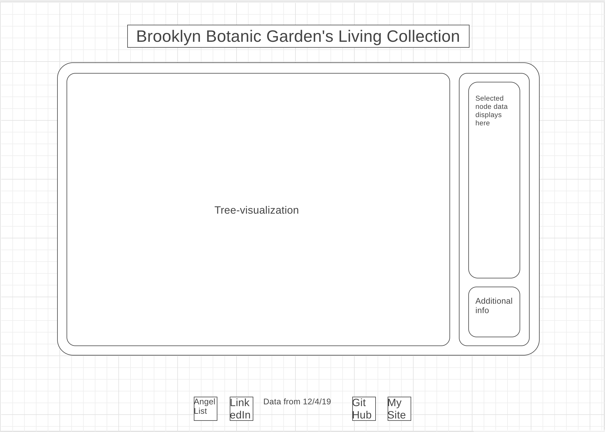

## Background and Overview
Brooklyn Botanic Garden (BBG) is a living museum dedicated to bringing an appreciation of the world of plants to the heart of their urban community. They are currently fighting development plans that would cast a shadow over the gardens and irreperably harm the collection.

This will visualize the BBG's Living Collection database in the shape of a tree:
* The root node will be BBG
* Branches will represent individual collections
* Sub-branches will represent a Genus found in a collection
* Leaves will represent an individual specimen

## Functionality and MVPs
The BBG Tree Explorer will give users a unique view and way of exploring a selection of plant genera  that can be found at Brooklyn Botanic Garden.

Users will be able to:
* Select a node and see the data related to it
* Collapse branches

## Wireframes

## Architecture and Technology
* CanvasHTML
* HTML/CSS
* Javascript
* D3

## Implementation Timeline
* Phase 1 (1/6 through 1/7)
    * Render Basic Tree
    * Make nodes selectable
* Phase 2 (1/8 through 1/10)
    * Import CSV Data
    * Refactor Tree incorporating Data
    * Selecting nodes renders data
* Phase 3 (1/10)
    * Complete HTML and CSS for site elements
    * Production README

## (Bonus Features)
* Toggle brown color on leaf nodes that will be affected by proposed development.
* Add more genera from the database
<!-- Allow the selection of other plant genera into the visualization. -->